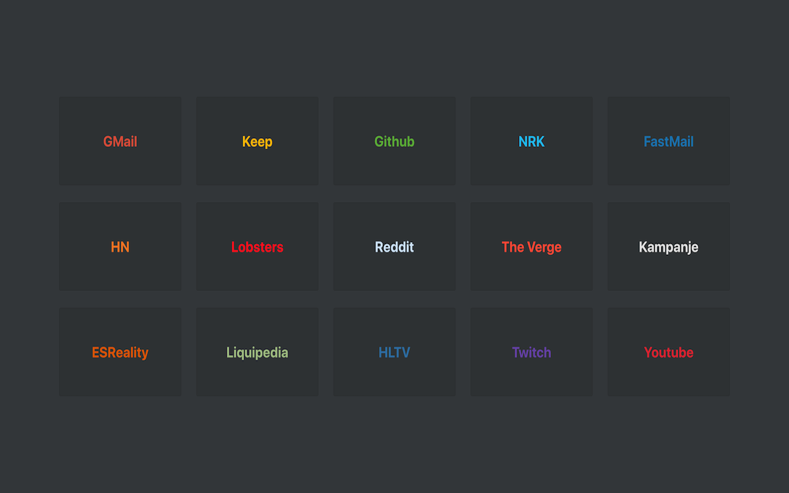

# My personal chrome startpage v2

I've never liked the default chrome startpage (new tab), so i created my own. You can find it on the:

- [Chrome webstore](https://chrome.google.com/webstore/detail/new-tab-speeddial-v2/iekhhppnomnclfcchdlfnlnfmdlbfono)
- [Firefox](https://addons.mozilla.org/en-US/firefox/addon/new-tab-speeddial-v2/)

Remember to add inline css after local development, compile sass with this command:

```bash
sass --style compressed --watch scss/style.scss:css/style.css
```


